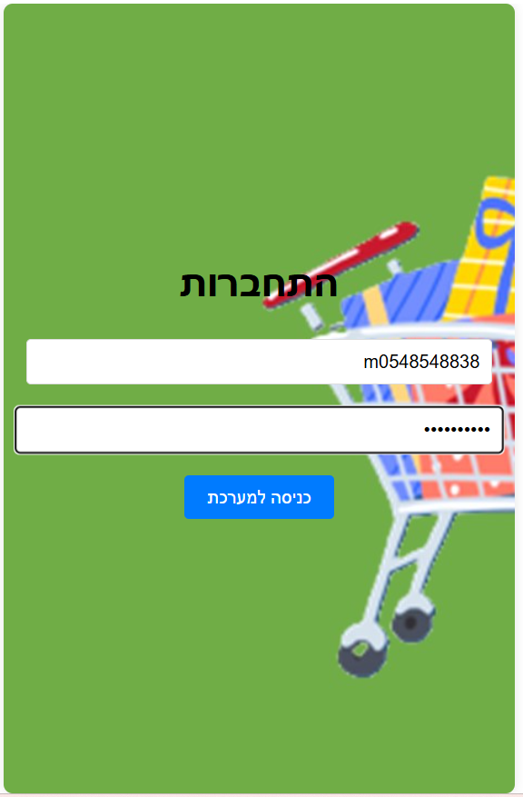
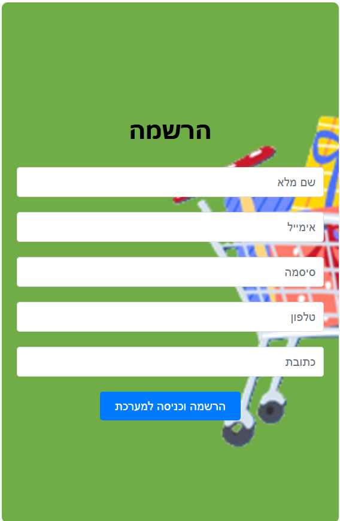
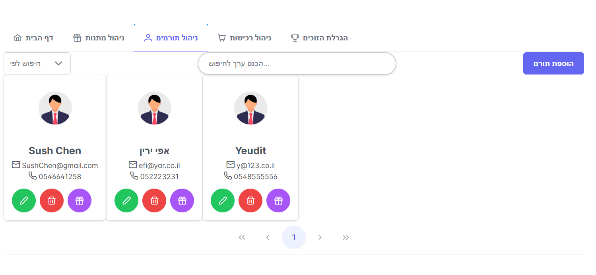
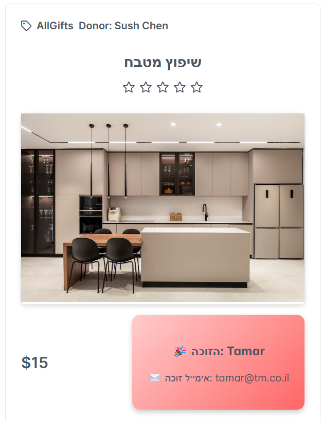
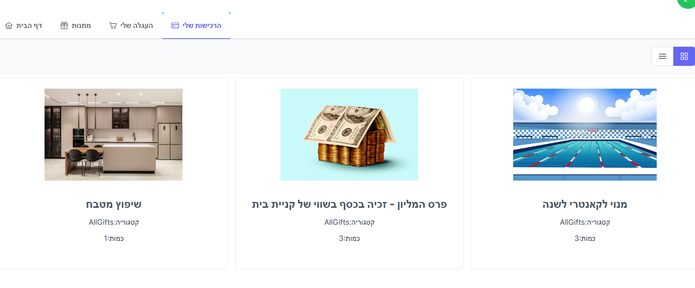
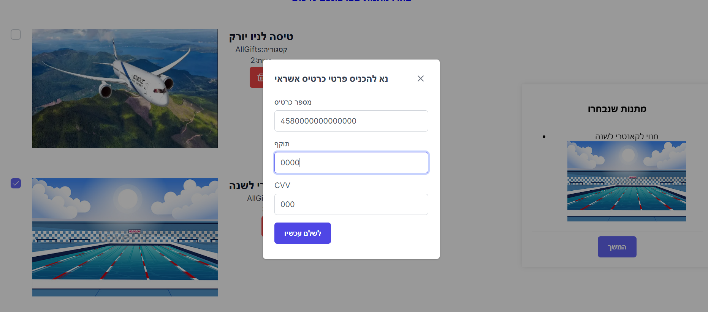

# **מערכת ניהול מכירה סינית**

ברוכים הבאים למערכת לניהול מכירה סינית!  
המערכת נבנתה כדי להקל על ניהול תהליך מכירה סינית, כולל רישום, רכישת כרטיסים, ניהול מתנות, והגרלת זוכים.  
המערכת כוללת ממשק משתמש ידידותי, פונקציות חיפוש ותכונות ניהול מתקדמות.
### Developed by Malki Applebaum ✍️


## **צילומי מסך של האתר**

### עמוד הבית הרשמה וכניסה:
<div>
  
  
  
</div>

### ממשק מנהל:
<div>
  
  
  
  
  
  
</div>

### ממשק משתמש:
<div>
  
  
  
  
</div>


---

## **תכונות עיקריות**

### **כניסה ורישום**
- **לקוחות**:
  - התחברות באמצעות שם משתמש וסיסמה.
  - רישום לקוח חדש עבור משתמשים חדשים.  

- **מנהלים**:
  - כניסה עם שם משתמש וסיסמה ייחודיים המעניקים גישה לפונקציות ניהול מתקדמות.

---

### **פונקציות ללקוחות**
- צפייה ברשימת כל המתנות הזמינות במכירה הסינית.
- סינון וחיפוש מתנות לפי שם, מחיר, או קטגוריות שונות.
- הוספת מתנות לסל קניות ורכישת כרטיסים להגרלה.

---

### **פונקציות למנהלים**
- **ניהול תורמים ומתנות**:
  - הוספת מתנות חדשות למכירה.
  - עדכון פרטי תורמים.
  - צפייה בפרטי מתנה ובכל הרוכשים שלה.  

- **ניהול ההגרלה**:
  - הגרלת זוכים באופן ידני לכל מתנה.
  - שליחת הודעות מייל אוטומטיות לזוכים על הזכייה.

- **דוחות אקסל**:
  - הורדת דוח הכנסות של המכירה הסינית בלחיצה אחת.
  - הורדת דוח אקסל של רשימת כל הזוכים, כולל באיזו מתנה זכו.

---

## **טכנולוגיות בשימוש**
- **Frontend**: React.js  
- **Backend**: ASP.NET Core  
- **Database**: SQL Server  
- **אבטחה**: JWT לניהול הרשאות וסשנים  
- **Excel Export**: יצירת קובצי Excel לניהול דוחות.  
- **אימיילים**: שליחת הודעות לזוכים באופן אוטומטי.

---

## **התקנה ושימוש**  
- יש לשכפל את הריפו למחשב מקומי:  
  ```bash
  git clone https://github.com/MalkiApplebaum/ChinessSaleAPP.git

